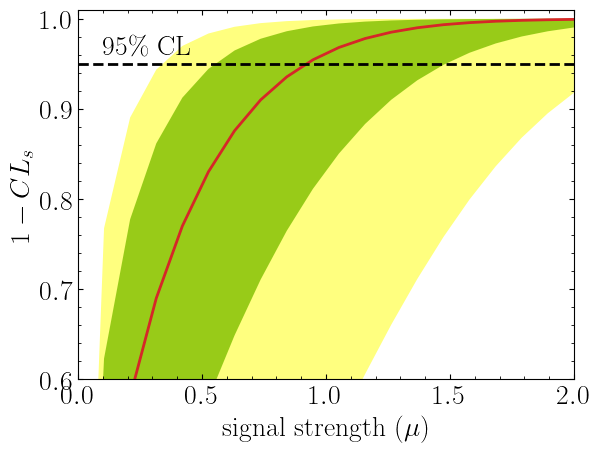

# Spey: smooth combination of statistical models for reinterpretation studies

A universal statistics package for reinterpretation studies. See the [documentation]() for details.

## Outline

* [Installation](#installation)
* [What is Spey?](#what-is-spey)
* [Usage](#usage)

## Installation

If you are using a specific branch you can either use `make install` or `pip install -e .`. **Note that `main` branch is not the stable version.** Stable version can either be downloaded from releases section or via pypi using the following command

```bash
pip install spey
```

## What is Spey?

Spey is a plug-in based statistics tool which aims to collect all likelihood prescriptions under one roof. This provides user the workspace to freely combine different statistical models and study them through a single interface. In order to achieve a module that can be used both with statistical model prescriptions which has been proposed in the past and will be used in the future, Spey uses so-called plug-in system where developers can propose their own statistical model prescription and allow spey to use them.

### What a plugin provides

A quick intro on terminology of spey plugins in this section:

* A plugin is an external Python package that provides additional statistical model prescriptions to spey.
* Each plugin may provide one (or more) statistical model prescription, that are accessible directly through spey.
* Depending on the scope of the plugin, you may wish to provide additional (custom) operations and differentiability through various autodif packages such as ``autograd``
  or ``jax``. As long as they are implemented through set of predefined function names spey can automatically detect and use them within the interface.

Finally, the name "Spey" originally comes from the Spey river, a river in mid-Highlands of Scotland. The area "Speyside" is famous for its smooth whiskey.

### Officially available plug-ins

* `simplified_likelihoods`: ...
* `spey-pyhf`: Details can be found at the [dedicated repository]().
* `spey-fastprof`: Details can be found at the [dedicated repository]().

## Usage

By default spey is shipped with `simplified_likelihood` backend which currently has four dedicated sub-plugin.

* `'simplified_likelihoods'`: Main simplified likelihood backend which uses a Multivariate Normal and a Poisson distributions to construct log-probability of the statistical model. The Multivariate Normal distribution is constructed by the help of a covariance matrix provided by the user which captures the uncertainties and background correlations between each histogram bin. This statistical model has been first proposed in [JHEP 04 (2019), 064](https://doi.org/10.1007/JHEP04%282019%29064).

* `'simplified_likelihoods.third_moment_expansion'`: Third moment expansion follows the above simplified likelihood construction and modifies the covariance matrix via third moment input.

* `'simplified_likelihoods.uncorrelated_background'`: User can use multi or single bin histograms with unknown correlation structure within simplified likelihood interface. This particular plug-in replaces Multivariate Normal distribution of the likelihood with a simple Normal distribution to reduce the computational cost.

* `'simplified_likelihoods.variable_gaussian'`: Variable Gaussian method is designed to capture asymetric uncertainties on the background yields. This method converts the covariance matrix in to a function which takes upper and lower envelops of the background uncertainties, best fit values and nuisance parameters which allows the interface dynamically change the covariance matrix with respect to given nuisance parameters. This implementation follows the method proposed in Ref. [arXiv:physics/0406120](https://arxiv.org/abs/physics/0406120).

The list of available backends can be found via `AvailableBackends()` function which will return the following:

```python
import spey
print(spey.AvailableBackends())
# ['simplified_likelihoods', 'simplified_likelihoods.third_moment_expansion', 'simplified_likelihoods.uncorrelated_background', 'simplified_likelihoods.variable_gaussian']
```

This function actively searches installed plugin entrypoints and extracts the ones that matches spey's requirements. A backend can be retreived via `get_backend` function

```python
stat_wrapper = spey.get_backend('simplified_likelihoods.uncorrelated_background')
```

Where the `stat_wrapper` is a function that aids the backend to be integrated within spey interface. Using this backend we can simply construct a single bin statistical model

```python
data = [1]
signal = [0.5]
background = [2.0]
background_unc = [1.1]

stat_model = stat_wrapper(
    signal, background, data, background_unc, analysis="single_bin", xsection=0.123
)
```

where this data represents an observation count of `1` with signal yields $0.5$ and background yields $2\pm1.1$. `analysis` keyword takes a unique identifier for the model and `xsection` is the cross section value of the signal. Both of these are optional parameters. Using this information one can compute the exclusion confidence level

```python
print("1-CLs : %.2f" % tuple(stat_model.exclusion_confidence_level()))
# 1-CLs : 0.40
```

Additionally upper limit on parameter of interest, $\mu$, can be computed via

```python
print("POU upper limit : %.2f" % stat_model.poi_upper_limit())
# POU upper limit : 6.73
```

One can also represent multibin uncorrelated statistical models via

```python
data = [1, 3]
signal = [0.5, 2.0]
background = [2.0, 2.8]
background_unc = [1.1, 0.8]

stat_model = stat_wrapper(
    signal, background, data, background_unc, analysis="multi-bin", xsection=0.123
)
print("1-CLs : %.2f" % tuple(stat_model.exclusion_confidence_level()))
# 1-CLs : 0.70
print("POU upper limit : %.2f" % stat_model.poi_upper_limit())
# POU upper limit : 2.17
```

Spey focuses on three main working points for expectation type i.e. `observed` which computes likelihood fits with respect to the observations, `aposteriori` beyond computing likelihood fits with observed values it computes the fluctuations in the background and returns $\pm1\sigma$ and $\pm2\sigma$ bands, `apriori` is similar to `aposteriori` where the only difference is that it assumes the Standard Model background is absolute truth. Using these one can compute the uncertainty bands on the expectation via

```python
print(stat_model.exclusion_confidence_level(expected=spey.ExpectationType.aposteriori))
# [0.945840731123488, 0.8657740143137352, 0.6959070047129498, 0.41884413918205454, 0.41034502645428916]
```

Which can be used to produce uncertainty plots such as

```python
import matplotlib.pyplot as plt
import numpy as np

poiUL = np.array([stat_model.exclusion_confidence_level(p, expected=spey.ExpectationType.aposteriori) for p in np.linspace(1,5,20)])
plt.plot(np.linspace(1,5,20), poiUL[:,2], color="tab:red")
plt.fill_between(np.linspace(1,5,20), poiUL[:,1], poiUL[:,3], alpha=0.8, color="green", lw=0)
plt.fill_between(np.linspace(1,5,20), poiUL[:,0], poiUL[:,4], alpha=0.5, color="yellow", lw=0)
plt.plot([1,5], [.95,.95], color="k", ls="dashed")
plt.xlabel("$\mu$")
plt.ylabel("$1-CL_s$")
plt.xlim([1,5])
plt.ylim([.4,1.01])
plt.text(4,0.9, r"$95\%\ {\rm CL}$")
plt.show()
```

